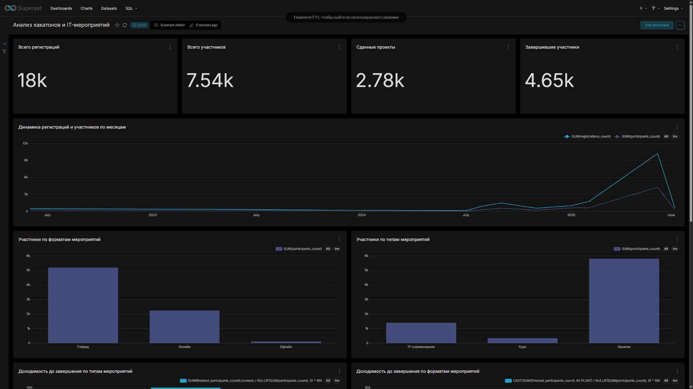
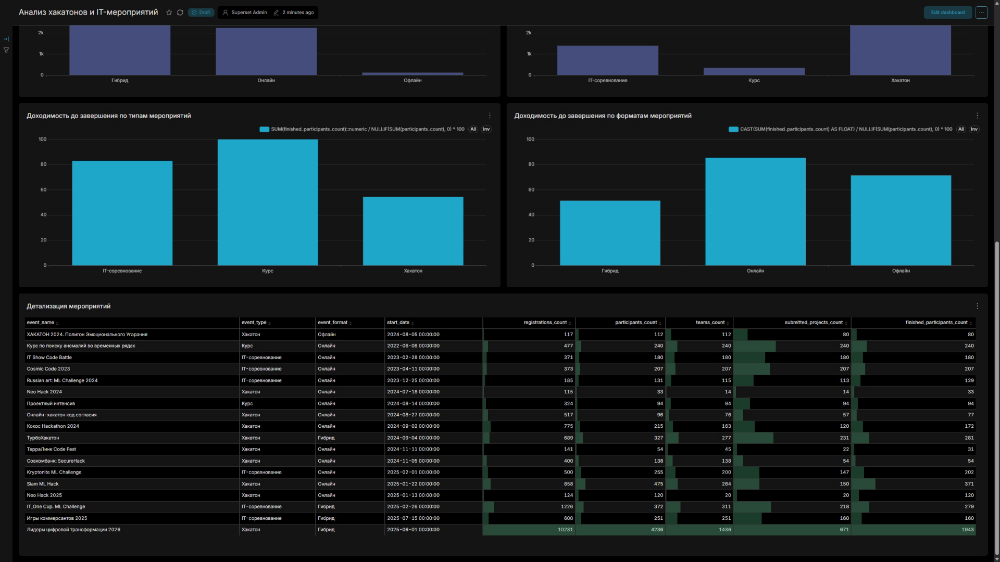

# Анализ хакатонов и IT-мероприятий

## Описание проекта

Проект посвящён анализу хакатонов, IT-соревнований и образовательных IT-форматов. Цель проекта - изучить воронку участия, динамику мероприятий, различия между типами и форматами событий, а также ключевые метрики завершения.

Проект выполнен как учебный аналитический кейс для развития навыков SQL, PostgreSQL и BI-аналитики. Тематика выбрана на основе практического опыта в организации IT-мероприятий, хакатонов и соревнований.

## Стек

- PostgreSQL
- SQL
- Apache Superset
- CSV
- GitHub

## Бизнес-вопросы

В рамках проекта рассматриваются следующие вопросы:

1. Сколько пользователей регистрируются, участвуют, сдают проекты и доходят до завершения мероприятия?
2. На каком этапе воронки происходит основная потеря участников?
3. Какие типы мероприятий показывают лучшую конверсию?
4. Как меняется количество мероприятий и участников по месяцам?
5. Какие форматы мероприятий показывают лучшую доходимость до завершения?

## Данные

В проекте используется обезличенный датасет по IT-мероприятиям. Одна строка в таблице соответствует одному мероприятию.

Основные поля:

| Поле | Описание |
|---|---|
| `event_id` | ID мероприятия |
| `event_name` | Название мероприятия |
| `event_type` | Тип мероприятия: хакатон, IT-соревнование, курс |
| `event_format` | Формат проведения: онлайн, офлайн, гибрид |
| `start_date` | Дата начала мероприятия |
| `end_date` | Дата окончания мероприятия |
| `registrations_count` | Количество регистраций |
| `participants_count` | Количество фактических участников |
| `submitted_projects_count` | Количество сданных проектов |
| `finished_participants_count` | Количество участников, дошедших до завершения |
| `teams_count` | Количество команд |

## Модель данных

Основная таблица проекта:

```sql
real_events
```

Таблица содержит агрегированные данные по мероприятиям и используется для расчёта метрик воронки, динамики и эффективности.

## Ключевые результаты

По итогам анализа 18 мероприятий:

| Метрика | Значение |
|---|---:|
| Количество мероприятий | 18 |
| Регистрации | 18 023 |
| Участники | 7 536 |
| Сданные проекты | 2 778 |
| Участники, дошедшие до завершения | 4 653 |
| Конверсия из регистрации в участие | 41,81% |
| Конверсия из участия в сдачу проекта | 36,86% |
| Конверсия из участия в завершение | 61,74% |

Основная потеря происходит между регистрацией и фактическим участием: до участия доходит менее половины зарегистрировавшихся.

## Структура репозитория

```text
hackathon-events-analytics/
│
├── README.md
├── data/
│   └── raw/
│       └── hackathon_events_real.csv
│
├── sql/
│   ├── 01_create_tables.sql
│   ├── 02_insert_sample_data.sql
│   ├── 03_funnel_analysis.sql
│   ├── 04_monthly_dynamics.sql
│   ├── 05_event_type_metrics.sql
│   ├── 06_event_size_segments.sql
│   ├── 07_top_events_by_participation_conversion.sql
│   ├── 08_top_events_by_finish_rate.sql
│   ├── 09_create_real_events_table.sql
│   ├── 10_data_quality_checks.sql
│   └── 11_real_events_analysis.sql
│
├── dashboard/
│   └── screenshots/
│       ├── README.md
│       ├── dashboard_overview.png
│       └── dashboard_details.png
│
└── docs/
    ├── insights.md
    └── report.md
```

## Основные SQL-запросы

В папке `sql/` находятся запросы для:

- создания таблицы;
- загрузки тестовых данных;
- анализа воронки участия;
- анализа динамики мероприятий по месяцам;
- сравнения метрик по типам мероприятий;
- сегментации мероприятий по размеру;
- поиска событий с лучшей конверсией в участие;
- поиска событий с лучшим процентом завершения;
- проверки качества данных;
- анализа реального обезличенного датасета.

## Дашборд

Результаты анализа визуализированы в Apache Superset. Дашборд включает KPI-карточки, динамику по месяцам, сравнение типов и форматов мероприятий, а также метрики доходимости до завершения.

| Чарт | Что показывает |
|---|---|
| KPI-карточки | Общее количество регистраций, участников, сданных проектов и завершивших участников |
| Динамика регистраций и участников по месяцам | Рост или спад активности во времени |
| Участники по типам мероприятий | Сравнение хакатонов, IT-соревнований и курсов по количеству участников |
| Участники по форматам мероприятий | Сравнение онлайн, офлайн и гибридных форматов |
| Доходимость до завершения | Сравнение типов и форматов мероприятий по доле участников, дошедших до завершения |

### Общий вид дашборда



Скриншот показывает верхнюю часть дашборда: KPI-карточки, динамику регистраций и участников по месяцам, а также распределение участников по форматам и типам мероприятий.

### Доходимость и детализация



Скриншот показывает нижнюю часть дашборда: доходимость до завершения по типам и форматам мероприятий, а также таблицу с детализацией по каждому событию.

## Основные выводы по данным

1. Всего в выборке 18 мероприятий, по которым собрано 18 023 регистрации и 7 536 фактических участников.
2. Общая конверсия из регистрации в участие составляет 41,81%, то есть основной отток происходит до старта или на этапе перехода от регистрации к участию.
3. IT-соревнования показывают более высокую доходимость до завершения: 82,88% против 54,46% у хакатонов.
4. Онлайн-формат показывает более высокую конверсию в завершение, чем гибридный формат: 85,34% против 51,35%.
5. Гибридные мероприятия дают основную массу регистраций и участников, но имеют более низкую доходимость до завершения.

Подробный отчёт находится в файле `docs/report.md`.

## Что можно улучшить

Возможные направления развития проекта:

- добавить данные на уровне отдельных участников;
- построить когортный анализ;
- добавить анализ команд;
- сравнить онлайн, офлайн и гибридные форматы;
- добавить прогноз количества участников для будущих мероприятий;
- выгрузить дашборд из Superset и добавить экспорт в репозиторий;
- подготовить Docker Compose для воспроизводимого запуска PostgreSQL и Superset.

## Как запустить проект

1. Создать базу данных в PostgreSQL.
2. Выполнить скрипт `sql/09_create_real_events_table.sql`.
3. Импортировать CSV-файл с обезличенными данными в таблицу `real_events`.
4. Выполнить проверки качества данных из файла `sql/10_data_quality_checks.sql`.
5. Выполнить аналитические запросы из файла `sql/11_real_events_analysis.sql`.
6. Изучить выводы в `docs/report.md`.
7. Подключить таблицу `real_events` к Apache Superset.
8. Собрать дашборд и сохранить скриншоты в папку `dashboard/screenshots/`.

## Автор

Валерий Балашов  
Учебный проект для портфолио аналитика.
